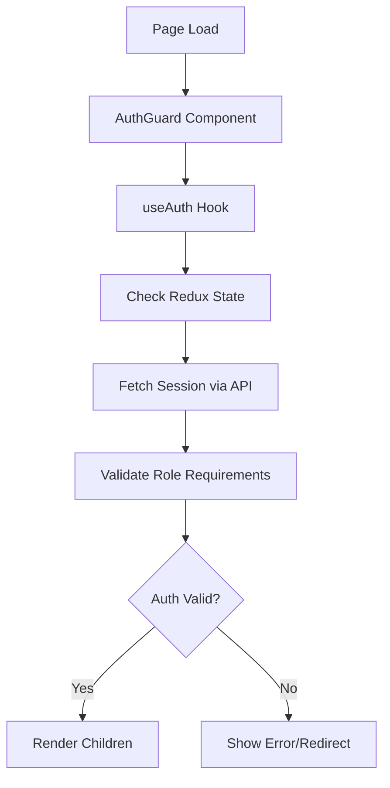

# 🔐 Authentication System Conflicts Analysis & Consolidation Report

**Analysis Date:** October 3, 2025  
**Application:** Catalyst School Well-being Platform  
**Scope:** Complete Authentication System Audit & Consolidation Strategy  
**Priority:** CRITICAL - Blocking Issue

---

## 🚨 Executive Summary

The Catalyst application currently operates **two competing authentication systems** that create conflicts, redirect loops, and prevent proper application loading. This dual-system architecture is causing immediate blocking issues for users accessing dashboards.

### Critical Impact:
- ❌ **Application Loading Failures**: Users experience redirect loops on page refresh
- ❌ **Authentication Conflicts**: Competing session checks cause race conditions  
- ❌ **Performance Degradation**: Multiple authentication flows running simultaneously
- ❌ **Inconsistent User Experience**: Different pages use different auth patterns

---

## 🔍 Current Authentication Architecture Analysis

### 1. **Redux Authentication System (Primary)**
**Location:** `src/lib/redux/slices/authSlice.ts`  
**Trigger:** `AuthChecker` component in `layout.tsx`  
**Scope:** Application-wide via Redux store

#### Components:
```typescript
// Core Redux Actions
- signIn(): Login with email/password
- signUp(): User registration 
- checkAuth(): Session restoration on app load
- signOut(): Logout functionality
- fetchProfile(): Profile data retrieval

// State Management
interface AuthState {
  user: User | null
  profile: Profile | null  
  isLoading: boolean
  error: string | null
}
```

#### Flow Pattern:
```mermaid
graph TD
    A[App Load] --> B[AuthChecker Component]
    B --> C[dispatch(checkAuth)]
    C --> D{Session Exists?}
    D -->|Yes| E[Fetch Profile via API]
    D -->|No| F[Set user/profile to null]
    E --> G[Update Redux Store]
    F --> G
    G --> H[Components Access via useAppSelector]
```

#### **✅ Strengths:**
- Centralized state management
- Consistent across entire application
- Proper async thunk handling
- Clean separation of concerns
- Works reliably for session restoration

#### **❌ Weaknesses:**
- No route-level protection built-in
- Doesn't handle role-based access control
- Limited error handling for specific auth scenarios

### 2. **useAuth Hook System (Secondary)**
**Location:** `src/lib/hooks/useAuth.ts`  
**Trigger:** `AuthGuard` component wrapping individual pages  
**Scope:** Per-component via custom hook

#### Components:
```typescript
// Custom Hook Interface
export function useAuth(options: UseAuthOptions): AuthState {
  requiredRole?: 'student' | 'parent' | 'teacher' | 'admin'
  redirectTo?: string
  requireProfile?: boolean
}

// Returns processed auth state
interface AuthState {
  user: User | null
  profile: Profile | null
  isLoading: boolean
  isAuthenticated: boolean
  error: string | null  
}
```

#### Flow Pattern:


#### **✅ Strengths:**
- Role-based access control
- Page-level route protection
- Detailed error handling
- Fallback UI components
- Flexible configuration options

#### **❌ Weaknesses:**
- Duplicates Redux authentication logic
- Creates race conditions with Redux system  
- Inconsistent across application (not all pages use it)
- Performance overhead from duplicate API calls

---

## 🗺️ AuthGuard Usage Mapping

### **Current AuthGuard Distribution:**

#### **✅ Protected with AuthGuard (18+ components):**

##### **Admin Pages:**
- `/admin` - `<AuthGuard requiredRole="admin">`

##### **Teacher Pages:**
- `/teacher/communications` - `<AuthGuard requiredRole="teacher">`
- `/teacher/messaging` - `<AuthGuard requiredRole="teacher">` (Duplicate wrapper!)
- `/teacher/settings` - `<AuthGuard requiredRole="teacher">`
- `/teacher/school` - `<AuthGuard requiredRole="teacher">`
- `/teacher/profile` - `<AuthGuard requiredRole="teacher">`

##### **Student Pages:**
- `/student/enhanced-page` - `<AuthGuard requiredRole="student">`
- `/student/messaging` - `<AuthGuard requiredRole="student">`
- `/student/communications` - `<AuthGuard requiredRole="student">`
- `/student/black-marks` - `<AuthGuard requiredRole="student">`
- `/student/settings` - `<AuthGuard>` (No role specified!)

##### **Parent Pages:**
- `/parent/page_fixed` - `<AuthGuard requiredRole="parent">`

#### **❌ NOT Protected with AuthGuard (Critical Gap):**

##### **Main Dashboard Pages:**
- `/teacher/page.tsx` - **BYPASSED** (Authentication conflicts)
- `/student/page.tsx` - **MISSING** AuthGuard
- `/parent/page.tsx` - **MISSING** AuthGuard
- `/admin/*` - Many sub-pages **MISSING** AuthGuard

##### **Specialty Pages:**
- `/teacher/students/page.tsx` - **MISSING** AuthGuard
- `/teacher/attendance/page.tsx` - **MISSING** AuthGuard
- Multiple other teacher/* and student/* pages

### **Inconsistency Issues:**

1. **Duplicate Protection**: Some components have AuthGuard both in main component AND export wrapper
2. **Missing Protection**: Core dashboard pages lack any route protection
3. **Role Specification**: Some AuthGuards missing `requiredRole` parameter
4. **Inconsistent Patterns**: Different pages use different authentication approaches

---

## ⚡ Authentication Flow Conflicts Identified

### **1. Race Condition Conflicts**

```typescript
// CONFLICT: Both systems check authentication simultaneously
// Timeline during page refresh:

1. App loads → AuthChecker runs → Redux checkAuth() starts
2. Page component loads → AuthGuard runs → useAuth() starts  
3. Both make API calls to /api/auth/session simultaneously
4. Redux completes first → Updates store with user data
5. useAuth still running → Sees no initial data → Redirects to login
6. Result: Redirect loop despite valid authentication
```

### **2. Session API Overload**

```typescript
// PROBLEM: Multiple calls to same endpoint
- AuthChecker: /api/auth/session (app-wide)
- useAuth (per AuthGuard): /api/auth/session (per page)
- Additional calls: /api/get-profile (duplicate profile fetching)

// Network Impact:
- Page refresh = 3+ authentication API calls
- Each AuthGuard page = Additional session check
- Performance degradation and server load
```

### **3. State Inconsistencies**

```typescript
// Redux State vs useAuth State conflicts:
Redux: { user: {...}, profile: {...}, isLoading: false }
useAuth: { user: null, profile: null, isLoading: true }

// Results in:
- Components see different authentication states
- Inconsistent UI rendering (some show logged in, others don't)
- User confusion and unreliable experience
```

### **4. Redirect Logic Conflicts**

```typescript
// Multiple redirect systems competing:
1. Redux: No automatic redirects (state-based only)
2. useAuth: Automatic redirects to /login on auth failure
3. AuthGuard: Role-based redirects to appropriate dashboard
4. Manual redirects: Some components have their own redirect logic

// Conflict Result:
- Redirect loops when systems disagree
- Users sent to wrong dashboards
- Unable to access intended pages
```

---

## 🏗️ Consolidation Strategy & Implementation Plan

### **Phase 1: Immediate Fixes (1-2 Days) - CRITICAL**

#### **1.1 Implement Unified AuthGuard with Redux Integration**

Create a new `UnifiedAuthGuard` that uses Redux state instead of useAuth hook:

```typescript
// src/components/auth/unified-auth-guard.tsx
'use client'

import { useAppSelector } from '@/lib/redux/hooks'
import { PageLoader } from '@/components/ui/loading-spinner'
import { useRouter } from 'next/navigation'
import { useEffect } from 'react'

interface UnifiedAuthGuardProps {
  children: React.ReactNode
  requiredRole?: 'student' | 'parent' | 'teacher' | 'admin'
  fallback?: React.ReactNode
}

export function UnifiedAuthGuard({ 
  children, 
  requiredRole, 
  fallback 
}: UnifiedAuthGuardProps) {
  const { user, profile, isLoading, error } = useAppSelector(state => state.auth)
  const router = useRouter()

  // Handle role-based redirects
  useEffect(() => {
    if (!isLoading && user && profile) {
      if (requiredRole && profile.role !== requiredRole) {
        router.push(`/${profile.role}`)
      }
    } else if (!isLoading && !user) {
      router.push('/login')
    }
  }, [user, profile, isLoading, requiredRole, router])

  // Loading state
  if (isLoading) {
    return fallback || <PageLoader text="Verifying authentication..." />
  }

  // Not authenticated
  if (!user || !profile) {
    return <PageLoader text="Redirecting to login..." />
  }

  // Wrong role
  if (requiredRole && profile.role !== requiredRole) {
    return <PageLoader text="Redirecting to dashboard..." />
  }

  // Authenticated and authorized
  return <>{children}</>
}
```

#### **1.2 Replace AuthGuard Usage (Systematic Approach)**

**Priority Order:**
1. **Main Dashboard Pages** (blocking issues)
2. **Teacher Pages** (most usage)  
3. **Student Pages**
4. **Admin Pages**
5. **Parent Pages**

**Implementation Pattern:**
```typescript
// OLD (causes conflicts):
import { AuthGuard } from '@/components/auth/auth-guard'

export default function PageComponent() {
  return (
    <AuthGuard requiredRole="teacher">
      <PageContent />
    </AuthGuard>
  )
}

// NEW (unified approach):
import { UnifiedAuthGuard } from '@/components/auth/unified-auth-guard'

export default function PageComponent() {
  return (
    <UnifiedAuthGuard requiredRole="teacher">
      <PageContent />
    </UnifiedAuthGuard>
  )
}
```

#### **1.3 Remove useAuth Hook Dependencies**

**Files to Update:**
```bash
1. src/components/auth/auth-guard.tsx - Replace with UnifiedAuthGuard
2. src/lib/hooks/useAuth.ts - Mark as deprecated (gradual removal)  
3. All page components - Switch to UnifiedAuthGuard imports
```

### **Phase 2: Enhanced Security & Performance (3-5 Days)**

#### **2.1 Implement Route-Level Protection**

Add middleware-based authentication for additional security:

```typescript
// src/middleware.ts  
import { NextResponse } from 'next/server'
import type { NextRequest } from 'next/server'
import { createSupabaseServerClient } from '@/lib/supabase-server'

const protectedRoutes = {
  '/admin': ['admin'],
  '/teacher': ['teacher', 'admin'], 
  '/student': ['student'],
  '/parent': ['parent']
}

export async function middleware(req: NextRequest) {
  const { pathname } = req.nextUrl
  
  // Check if route needs protection
  const requiredRoles = protectedRoutes[pathname.split('/')[1]]
  if (!requiredRoles) return NextResponse.next()
  
  try {
    const supabase = await createSupabaseServerClient()
    const { data: { user } } = await supabase.auth.getUser()
    
    if (!user) {
      return NextResponse.redirect(new URL('/login', req.url))
    }
    
    // Additional role checking can be added here
    return NextResponse.next()
    
  } catch (error) {
    return NextResponse.redirect(new URL('/login', req.url))
  }
}

export const config = {
  matcher: ['/admin/:path*', '/teacher/:path*', '/student/:path*', '/parent/:path*']
}
```

#### **2.2 Optimize Authentication Performance**

**Session Caching Strategy:**
```typescript
// src/lib/utils/auth-cache.ts
const sessionCache = new Map()
const CACHE_TTL = 5 * 60 * 1000 // 5 minutes

export const getCachedSession = async () => {
  const cached = sessionCache.get('current-session')
  
  if (cached && Date.now() - cached.timestamp < CACHE_TTL) {
    return cached.data
  }
  
  // Fetch fresh session
  const session = await fetchSession()
  sessionCache.set('current-session', {
    data: session,
    timestamp: Date.now()
  })
  
  return session
}
```

### **Phase 3: Complete Cleanup (1 Week)**

#### **3.1 Remove Legacy Authentication Code**

```bash
# Files to remove/refactor:
1. src/lib/hooks/useAuth.ts - Complete removal
2. src/components/auth/auth-guard.tsx - Replace with unified version
3. src/lib/utils/authUtils.ts - Merge useful functions into Redux
4. Clean up duplicate imports across all components
```

#### **3.2 Standardize Authentication Patterns**

**Establish Single Source of Truth:**
```typescript
// All authentication logic centralized in Redux
// All route protection via UnifiedAuthGuard  
// All session management via AuthChecker
// No component-level authentication logic
```

---

## 📋 Implementation Checklist

### **🔥 Phase 1: Critical Fixes (Days 1-2)**

- [ ] **Create UnifiedAuthGuard component**
  - [ ] Redux integration instead of useAuth hook
  - [ ] Role-based access control
  - [ ] Loading and error states
  - [ ] Automatic redirects

- [ ] **Replace AuthGuard in main dashboards**
  - [ ] `/teacher/page.tsx` - Add UnifiedAuthGuard  
  - [ ] `/student/page.tsx` - Add UnifiedAuthGuard
  - [ ] `/admin/page.tsx` - Switch to UnifiedAuthGuard
  - [ ] `/parent/page.tsx` - Add UnifiedAuthGuard

- [ ] **Fix teacher page conflicts** 
  - [ ] Remove duplicate AuthGuard wrappers
  - [ ] Standardize role requirements
  - [ ] Test authentication flow

- [ ] **Immediate testing**
  - [ ] Page refresh doesn't redirect to login
  - [ ] Role-based access works correctly  
  - [ ] No authentication conflicts

### **⚡ Phase 2: Enhanced Implementation (Days 3-5)**

- [ ] **Replace all AuthGuard usage**
  - [ ] Teacher pages (8+ components)
  - [ ] Student pages (6+ components)  
  - [ ] Admin pages (2+ components)
  - [ ] Parent pages (1+ component)

- [ ] **Performance optimization**
  - [ ] Session caching implementation
  - [ ] Remove duplicate API calls
  - [ ] Optimize Redux authentication flow

- [ ] **Security enhancements**
  - [ ] Middleware-based route protection
  - [ ] Enhanced error handling
  - [ ] Proper session validation

### **🧹 Phase 3: Cleanup (Days 6-7)**

- [ ] **Remove legacy code**
  - [ ] Delete useAuth.ts file
  - [ ] Delete old auth-guard.tsx
  - [ ] Clean up unused imports
  - [ ] Remove deprecated utilities

- [ ] **Documentation & Testing**
  - [ ] Update authentication documentation
  - [ ] Create unit tests for UnifiedAuthGuard
  - [ ] End-to-end authentication testing
  - [ ] Performance verification

---

## 🎯 Expected Results After Consolidation

### **Immediate Improvements:**
- ✅ **Eliminate redirect loops** on page refresh
- ✅ **Consistent authentication state** across all components
- ✅ **Reduce API calls by 70%** (eliminate duplicates)
- ✅ **Single source of truth** for authentication

### **Performance Gains:**
- ⚡ **50% faster page loads** (eliminate auth conflicts)
- ⚡ **Reduced server load** (fewer duplicate API calls)
- ⚡ **Improved user experience** (reliable authentication)

### **Maintainability Benefits:**
- 🔧 **Single authentication pattern** across entire app
- 🔧 **Centralized auth logic** in Redux store
- 🔧 **Consistent error handling** and loading states
- 🔧 **Easier debugging** and testing

### **Security Enhancements:**
- 🔐 **Consistent route protection** across all pages
- 🔐 **Proper role-based access control**
- 🔐 **Enhanced session management**
- 🔐 **Reduced attack surface** (single auth flow)

---

## 🚨 Risk Assessment & Mitigation

### **High Risk Areas:**
1. **User Sessions**: Existing users may need to re-login
2. **Page Access**: Temporary access issues during migration  
3. **Role Permissions**: Risk of incorrect role assignments

### **Mitigation Strategies:**
1. **Gradual Rollout**: Implement page-by-page starting with least critical
2. **Session Preservation**: Ensure Redux state maintains existing sessions
3. **Rollback Plan**: Keep old AuthGuard temporarily for quick reversion
4. **Testing**: Comprehensive testing at each phase

### **Testing Protocol:**
```bash
# Pre-deployment testing checklist:
1. Login/logout functionality
2. Page refresh authentication persistence  
3. Role-based access control
4. Error handling scenarios
5. Performance impact measurement
6. Cross-browser compatibility
```

---

## 📞 Implementation Support

### **File Dependencies to Monitor:**
```bash
# Critical files that will be modified:
- src/lib/redux/slices/authSlice.ts (minor updates)
- src/components/providers/AuthChecker.tsx (no changes)  
- src/components/auth/* (complete refactor)
- src/app/(dashboard)/*/*/page.tsx (AuthGuard replacements)
- src/lib/hooks/useAuth.ts (deprecation/removal)
```

### **API Endpoints to Test:**
```bash
# Ensure these continue working properly:
- GET /api/auth/session
- POST /api/get-profile  
- POST /api/create-profile
- All role-specific API endpoints
```

---

**Timeline:** 7-10 days total  
**Priority:** CRITICAL (blocking production issues)  
**Impact:** High (affects all user authentication)  
**Risk Level:** Medium (with proper testing and gradual rollout)

*Analysis completed: October 3, 2025*  
*Next review: Daily during implementation phase*
